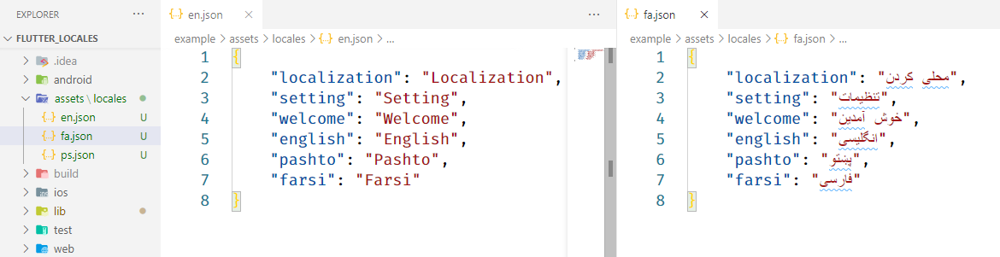

# flutter_locales

**Localize your Flutter app within seconds to multiple locales**

## Why Flutter Locales
- [x] Easily Localize your app
- [x] Change App Locale within app
- [x] Save Locale Language After changed
- [x] Get Last Changed locale on App starts
- [x] Easily Get Translation with `LocaleText('key')` Widget
- [x] Easily Change Locale with `LocaleNotifier.of(context).change('en')`

## Example App
Look at a Simple app at [GitHub](https://github.com/iampopal/flutter_locales/tree/master/example).


### 1) Create locales assets
Create an assets/locales folder at the root of your project and add your locales json files. 
> like:


### 2) Include package and assets
> Include latest dependency of flutter_locales
```
dependencies:
  flutter:
    sdk: flutter
  flutter_locales:
```
> Include assets/locales/ folder
```
flutter:
  uses-material-design: true
  assets:
    - assets/locales/
```


### 3) Initialize app

> Replace your main app with
```
void main() async {
  WidgetsFlutterBinding.ensureInitialized();
  await Locales.init(['en', 'fa', 'ps']); // get last saved language
  // remove await if you want to get app default language

  runApp(MyApp());
}
```

> Wrap your `MaterialApp` with `LocaleBuilder`
```
class MyApp extends StatelessWidget {
  @override
  Widget build(BuildContext context) {
    return LocaleBuilder(
      builder: (locale) => MaterialApp(
        title: 'Flutter Locales',
        localizationsDelegates: Locales.delegates,
        supportedLocales: Locales.supportedLocales,
        locale: locale,
        theme: ThemeData(primarySwatch: Colors.blue),
        home: HomeScreen(),
      ),
    );
  }
}
```
* `LocaleBuilder` rebuild the app you change the app locale by `LocaleNotifier.of(context).change('ps')`

## Change App Locale
`LocaleNotifier` Use To change app locale
```
LocaleNotifier.of(context).change('ps')
```
- When you change app automatically saves at Locale
- To get current locale call `LocaleNotifier.of(context).locale`

## Locale Text
`LocaleText` Widget Use to translate a key
```
LocaleText(`welcome`);
```
* `LocaleText` Translate a key to string 
*  To get a key translated call `Locales.string(context, 'welcome')`

## Getting Started
This project is a starting point for a Dart
[package](https://flutter.dev/developing-packages/),
a library module containing code that can be shared easily across
multiple Flutter or Dart projects.

For help getting started with Flutter, view our 
[online documentation](https://flutter.dev/docs), which offers tutorials, 
samples, guidance on mobile development, and a full API reference.
