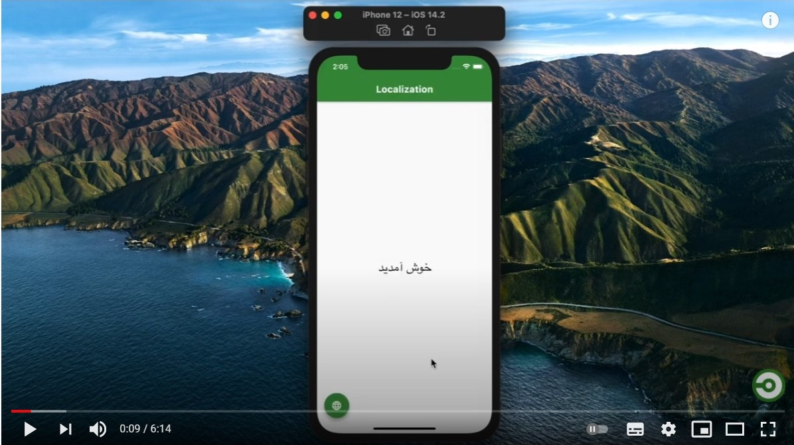

# flutter_locales

**Localize your Flutter app to multiple locales within seconds**

## Why Flutter Locales
✅ Easily Localize your app <br />
✅ Change App Locale within the app <br />
✅ Get Last Changed locale on App starts <br />
✅ Save Locale Language After changed buy `LocaleNotifier` <br />
✅ Get Translation with `LocaleText('key')` Widget <br />

## Example App
Look at a Simple app at [GitHub](https://github.com/iampopal/flutter_locales/tree/master/example).


## Video Tutorial
[](https://youtu.be/53sWTXgzR0U)

## 1) Create locales assets
Create an assets/locales folder at the root of your project and add your locales json files. 
**like:**

* your locale files name shall be name of the language 
  * like: 
    * **en.json** For english locales
    * **ps.json** for pashto locales

## 2) Include package and assets
> Include latest dependency of flutter_locales
```
dependencies:
  flutter:
    sdk: flutter
  flutter_locales:
```
> Include assets/locales/ folder
```
flutter:
  uses-material-design: true
  assets:
    - assets/locales/
```


## 3) Initialize app

> Replace your main app with
```dart
void main() async {
  WidgetsFlutterBinding.ensureInitialized();
  await Locales.init(['en', 'fa', 'ps']); // get last saved language
  // remove await if you want to get app default language

  runApp(MyApp());
}
```
  * `['en', 'fa', 'ps']` are language codes of `.json` files located in located in `assets/locales` folder   
  * You can replace these languages with your languages

> Wrap your `MaterialApp` with `LocaleBuilder` then provide locale to app
```dart
class MyApp extends StatelessWidget {
  @override
  Widget build(BuildContext context) {
    return LocaleBuilder(
      builder: (locale) => MaterialApp(
        title: 'Flutter Locales',
        localizationsDelegates: Locales.delegates,
        supportedLocales: Locales.supportedLocales,
        locale: locale,
        home: HomeScreen(),
      ),
    );
  }
}
```
* `LocaleBuilder` rebuild the app you change the app locale by `Locales.change(context, 'fa')`

## Locale Text
`LocaleText` Widget Use to translate a key
```dart
LocaleText(`welcome`);
```
* `LocaleText` Translate a key to string

### Locale String
*  To get a key translated call 
```dart
Locales.string(context, 'welcome')

// with extension
context.localeString('welcome');
```

## Change App Locale
To change app locale language
```dart
Locales.change(context, 'fa');

//with extension
context.changeLocale('fa');
```
- When you change app automatically saves at Locale

### Current Locale Language
- To get current locale call 
```dart 
Locales.currentLocale(context);

//with extension
context.currentLocale;
```

## Getting Started
This project is a starting point for a Dart
[package](https://flutter.dev/developing-packages/),
a library module containing code that can be shared easily across
multiple Flutter or Dart projects.

For help getting started with Flutter, view our 
[online documentation](https://flutter.dev/docs), which offers tutorials, 
samples, guidance on mobile development, and a full API reference.
